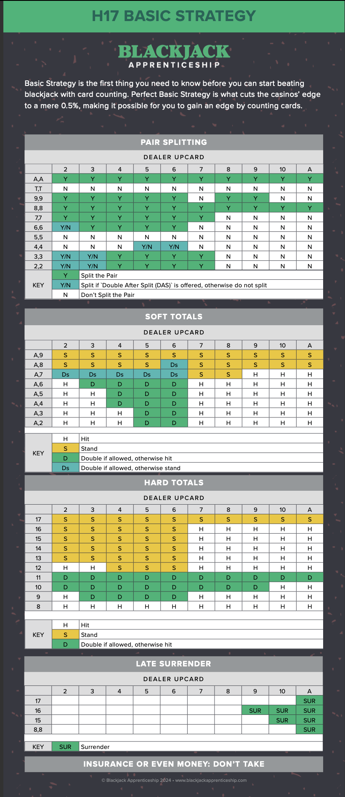
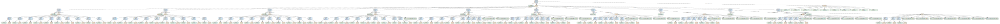
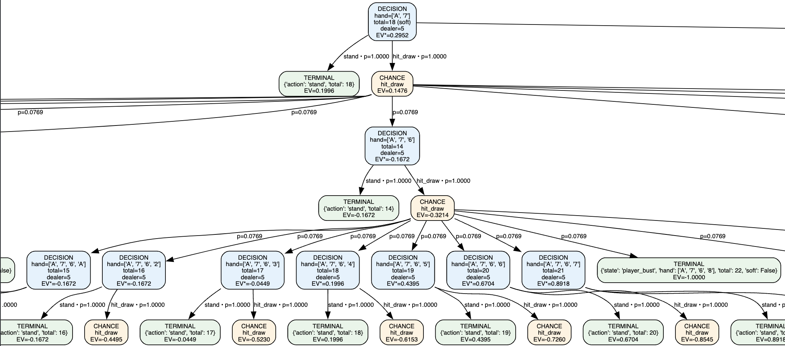

# blackjack-player-analysis

An evaluation of a blackjack player's play style compared to Perfect Basic Strategy (PBS), with house-edge estimates, per-player LaTeX/PDF reports, and a Blackjack decision game-tree visualizer.

---

## Table of Contents

* [Overview](#overview)
* [Features](#features)
* [System and Dependencies](#system-and-dependencies)
* [Project Layout](#project-layout)
* [Usage](#usage)

  * [1) Run the Simulator](#1-run-the-simulator)
  * [2) Analyze a Game CSV (per-player reports)](#2-analyze-a-game-csv-perplayer-reports)
  * [3) Render a Decision Game-Tree](#3-render-a-decision-game-tree)
* [Perfect Basic Strategy (PBS) Assumptions](#perfect-basic-strategy-pbs-assumptions)
* [House-Edge Methodology](#house-edge-methodology)
* [CSV Schema](#csv-schema)
* [Reports](#reports)
* [Game-Tree: JSON + Graphviz](#game-tree-json--graphviz)
* [Troubleshooting](#troubleshooting)
* [Development](#development)
* [Testing](#testing)
* [Performance Tips](#performance-tips)
* [License](#license)

---

## Overview

This toolkit simulates multi-player blackjack rounds, records complete action histories, and evaluates each player’s decisions against Perfect Basic Strategy (PBS). It estimates how deviations affect the expected house edge, summarizes player style (Aggressive/Conservative/Neutral), and generates per-player LaTeX reports (optional PDF) with round-by-round history and deviation explanations. It also includes a small game-tree builder with probabilities (infinite deck assumption) and EVs, plus a Graphviz visualizer.

---

## Features

* **Simulator**: Multi-player rounds, splitting, doubling, surrender, peeking, H17/S17, DAS.
* **Analyzer**: Compares every decision to PBS, tags **Complies/Deviates**, classifies style.
* **House-Edge**: Baseline PBS edge + per-deviation penalty model → round/session expected edge.
* **Reporting**: One **LaTeX file per player** (optionally compile to PDF) + CSV artifacts.
* **Summaries with Ollama**: Optional one-paragraph NLP summary embedded in each report.
* **Game-Tree**: Enumerates actions (hit/stand/double/split), computes branch probabilities & EVs, outputs JSON and Graphviz.

---

## System and Dependencies

This project was developed on a 2025 M4 MacBook Pro with 24GB of RAM. All usage instructions below are tailored for macOS.

> **NOTE:** Run all bash commands **from the project root** (`blackjack-player-analysis`).

* Install and run **Ollama for Mac**: [https://ollama.com/download](https://ollama.com/download)
* Python deps:

  ```bash
  pip install -r requirements.txt
  ```
* LaTeX (for reports):

  ```bash
  brew install --cask mactex
  # after install, make sure pdflatex is on PATH (you may need to open a new shell)
  which pdflatex
  ```
* Graphviz (for tree visualization):

  ```bash
  brew install graphviz
  ```

---

## Project Layout

```
blackjack-player-analysis/
├─ resources/                    # images and other resources
├─ src/
│  ├─ blackjack_simulator/
│  │  ├─ game.py                 # entrypoint for simulation
│  │  ├─ player.py               # LLM player
│  │  └─ ...
│  ├─ analysis_engine/
│  │  ├─ analyze.py              # PBS comparison (per-decision)
│  │  ├─ house_edge.py           # expected edge math + report builder
│  │  ├─ run_analysis.py         # CLI: reads CSV → per-player LaTeX + CSVs
│  │  └─ ...
│  ├─ game_tree/
│  │  ├─ tree_svgs/
│  │  │  └─ ...                 # game tree svgs stored here
│  │  │ 
│  │  ├─ blackjack_tree.py       # tree builder + EV with infinite deck
│  │  ├─ generate_tree.py   # Graphviz renderer
│  │  └─ ...
│  └─ utils/
│     └─ game_utils.py
├─ src/data/                     # simulator outputs (CSV rounds)
├─ src/reports/                  # analysis outputs (CSVs, .tex/.pdf)
├─ requirements.txt
├─ .gitignore
├─ LICENSE
└─ README.md
```

---

## Usage

### 1) Run the Simulator

Run a 20-round game with 2 players (aggressive vs conservative), \$1,000 bankroll, $50 base bet (for more granular control, see src/blackjack_simulator/game.py):

```bash
python -m src.blackjack_simulator.game \
  --n-players 2 \
  --player-type conservative,aggressive \
  --rounds 20 \
  --starting-bankroll 1000 \
  --base-bet 50
```

The complete game data is saved CSV to `src/data/DATE:TIME.csv`.

> **NOTE:** Running the example game takes approximately 15 mins due to the speed of Ollama inference and the linear nature of Blackjack preventing asynchronous programming. Games with >5 players and >50 rounds may take hours to complete.

### 2) Analyze a Game CSV (per-player reports)

Given a CSV (replace the path with your file), generate per-player LaTeX and PDF reports:

```bash
python -m src.analysis_engine.run_analysis src/data/10-09-2025:21:35:47.csv
```

Outputs to `src/reports/`, e.g.:


* `TIMESTAMP_analysis_report_player_{ID}.tex` (+ `.pdf`)

> If `pdflatex` is available, the CLI can compile each `.tex` into a `.pdf`. You can also compile manually:
>
> ```bash
> pdflatex src/reports/your_report.tex
> ```

### 3) Render a Decision Game-Tree

Quick example (SVG output):

```bash
python -m src.game_tree.generate_tree --hand "AH,7C" --dealer "5D"
```

This writes `src/game_tree/tree_svgs/blackjack_A_7_vs_6.svg`

---

## Perfect Basic Strategy (PBS) Assumptions

The default policy matches multi-deck **H17**, **DAS allowed**, **late surrender** (LS) where noted. Pair splitting (including Aces rules), soft totals, and hard totals follow standard charts. You can alter rules (e.g., S17) in both the simulator and the tree builder. The following chart displays the ruleset and PBS strategy used for this project


---

## House-Edge Methodology

We compute:

* **Expected house edge under PBS**: a baseline (e.g., ~0.65% for 6D H17 DAS LS).
* **Deviation penalties**: for common mistakes (e.g., standing 12 vs 2), we add a small % of base wager (e.g., +0.30%). These are **approximate** yet directionally useful.
* **Per round**: `Expected_Actual = PBS_Baseline + Σ Penalties(round)`.
* **Session**: wager-weighted averages across rounds.

We also report **realized** house edge from the actual results (`-profit / total_wager`) for context (variance expected).

---

## CSV Schema

Simulator rows include (subset; see code for full set):

* `timestamp_utc` – ISO time
* `player_id` – seat index
* `table_id` - the table (only 1 table for now)
* `base_bet` – initial wager for the player that round
* `result` – net result (player perspective)
* `dealer_upcard` – dealer’s upcard string (e.g., `6S`)
* `player_hands_json` – list of hands with cards, flags (doubled/surrendered/etc.)
* `player_actions_json` – sequence of player actions (hit/stand/double/split/surrender)
* `meta_json` – rules, decks, penetration, etc.

The analyzer ingests this CSV and produces the artifacts listed above.

---

## Reports

For each player:

* **Overview**: One-paragraph, LLM-generated summary (via **Ollama**; optional).
* **Session Summary Table**: rounds, total wager, realized vs expected edges.
* **Style Summary Table**: deviations, conservative/aggressive counts, style label.
* **Betting History** (longtable): time, bet, result, realized & expected edge.
* **Deviations** (longtable): decision context, PBS recommendation, penalty estimate.

Files are written to `src/reports/` as `TIMESTAMP_analysis_report_player_{ID}.tex` and, if `pdflatex` is present, a matching `.pdf`.

---

## Game-Tree: JSON + Graphviz

* **JSON export**: Nodes record state (player total/soft, dealer upcard, action, bust/stand, etc.), probability under infinite deck, and EV.
* **Graphviz**: Compact visualization with tooltips (EV, prob), optional pruning by probability, and “best path only” mode.

> Ensure `dot` is on PATH (`brew install graphviz`).

Example game tree:



Zoomed in:



---

## Troubleshooting

**`pdflatex: Unicode character … not set up`**
Escape/normalize text inserted into LaTeX. We replace Unicode suits and punctuation (e.g., `♦` → `\ensuremath{\diamondsuit}`) in the report generator. If you add custom text, sanitize it the same way.

**`Missing \endcsname inserted` / label errors**
Labels must be alphanumeric/underscore only. We sanitize labels and filenames to avoid `:` and other specials. If you inject custom labels, strip punctuation.

**`longtable Warning: Table widths have changed. Rerun LaTeX.`**
This is normal; LaTeX often needs a second pass. The CLI runs `pdflatex` twice.

**Graphviz not found**
Install with `brew install graphviz`. Ensure `dot -V` works.

**Ollama connection**
Start Ollama app first, and ensure your model (e.g., `gpt-oss:20b`) is available: `ollama pull gpt-oss:20b`.

---
## Performance Tips

* Simulator speed depends on player policy; LLM players are slower (network/local inference). Use `RandomPlayer` for high-volume runs or set smaller `n_rounds` when testing.
* Game-tree growth is exponential. Use `--max-depth`, `--max-nodes`, and `--collapse-prob` to prune.

---

## License

[](https://github.com/MeyerTalon/blackjack-player-analysis/LICENSE)